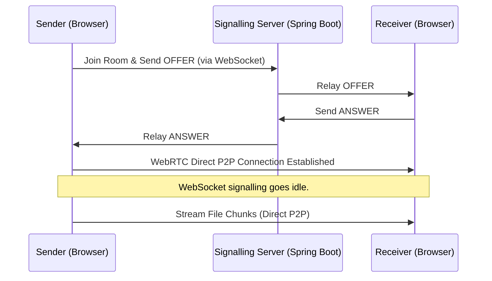

# Share-It 🚀

**Share-It** is a secure, high-performance, developer-centric **Peer-to-Peer (P2P) file sharing application** designed to transfer files directly between web browsers. It eliminates the need for middleman cloud storage, ensuring private, fast, and secure file streams.

The project is built using a modern full-stack architecture: a **Spring Boot (Java 21)** WebSocket server for signalling and a **React 19 / Vite / Tailwind CSS v4** frontend for the dashboard.

---

## 🏗️ Architecture & How It Works

Share-It establishes a direct connection between two peers using **WebRTC (RTCPeerConnection & RTCDataChannel)**. Since WebRTC peers cannot locate each other directly without assistance, a WebSocket server facilitates the initial exchange of connection metadata (Offers, Answers, and ICE candidates). Once the connection is established, the WebSocket signaling channel goes idle, and all data transfers occur directly between the users.



---

## 🌟 Key Features

*   **True P2P File Sharing**: Stream files directly browser-to-browser over WebRTC data channels with zero server storage.
*   **Hybrid Memory-Efficient Storage Engine**:
    *   **Direct Disk Stream (Disk/Direct)**: Utilizes the modern HTML5 **File System Access API** (`showSaveFilePicker`) to stream binary file chunks directly onto the user's local disk, completely avoiding memory footprint.
    *   **IndexedDB Buffer (Fallback)**: When browser support is missing, chunks are buffered inside a client-side database (`ShareItDB`) and assembled on completion. This prevents browser crashes when handling large files (>1GB).
*   **WebSocket Signalling Gateway**: Built with **Spring Boot** and **STOMP (Simple Text Oriented Message Protocol)** over WebSockets for robust and lightweight room management and session negotiation.
*   **Live Metrics Dashboard**: Real-time visualization of connection states, transfer progress (%), and active transfer speeds (e.g. MB/s).
*   **Signalling Broker Logs**: On-screen log console mapping WebRTC lifecycle events, outbound signals, and exceptions.
*   **Broadband Room Chat**: Inter-room chat built over the signalling gateway to coordinate peer actions.

---

## 🛠️ Technology Stack

*   **Frontend**: React 19, Vite, Tailwind CSS v4, WebRTC API, `@stomp/stompjs`
*   **Backend**: Java 21, Spring Boot 4 (Starter Web, Starter WebSocket), Maven
*   **Signalling Protocol**: STOMP over WebSockets

---

## 🚀 Getting Started (Run Locally)

### Prerequisites
*   **Java 21 JDK** or newer installed.
*   **Node.js** (v18+) and npm installed.

### 1. Start the Signalling Server (Backend)
Navigate to the `backend` directory, build the project, and run the boot application:
```bash
cd backend
# Make Maven wrapper executable (Linux/macOS)
chmod +x mvnw
# Run the application
./mvnw spring-boot:run
```
The signalling server will boot on `http://localhost:8080` with the STOMP endpoint configured at `/ws-signalling`.

### 2. Start the Client Interface (Frontend)
Open a new terminal, navigate to the `frontend` directory, install dependencies, and start the development server:
```bash
cd frontend
# Install dependencies
npm install
# Start dev server
npm run dev
```
The interface will run locally, typically at `http://localhost:5173`.

---

## 📂 Project Structure

```
Share-It/
├── backend/
│   ├── src/main/java/org/example/backend/
│   │   ├── config/WebSocketConfig.java       # WebSocket & STOMP endpoint configuration
│   │   ├── model/SignallingMessage.java      # Signalling schema POJO
│   │   ├── web/SignallingController.java      # Signaling relay controllers
│   │   └── BackendApplication.java           # Spring Boot entry point
│   └── pom.xml                               # Backend dependencies & Maven config
├── frontend/
│   ├── src/
│   │   ├── component/
│   │   │   ├── Signal.jsx                    # Primary connection terminal UI
│   │   │   └── FileProcessor.jsx             # File chunking & stream handling UI
│   │   ├── hooks/
│   │   │   └── useWebRTC.js                  # Custom WebRTC hook managing connection state
│   │   ├── App.jsx                           # Root layout
│   │   └── index.css                         # Tailwind CSS configurations
│   ├── package.json                          # Frontend dependencies & scripts
│   └── vite.config.js                        # Vite configuration
└── README.md                                 # Project documentation
```

---

## 🔧 Future Roadmap
- [ ] **STUN/TURN Integration**: Connect using remote cloud STUN/TURN servers to enable cross-network connections over cellular or corporate firewalls.
- [ ] **Multi-Peer Rooms**: Support sending files to multiple peers simultaneously in a single session.
- [ ] **End-to-End Encryption (E2EE)**: Implement encryption layers over WebRTC data channels for sensitive data sharing.
